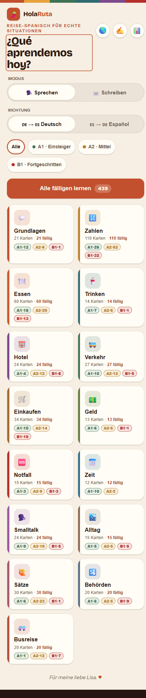
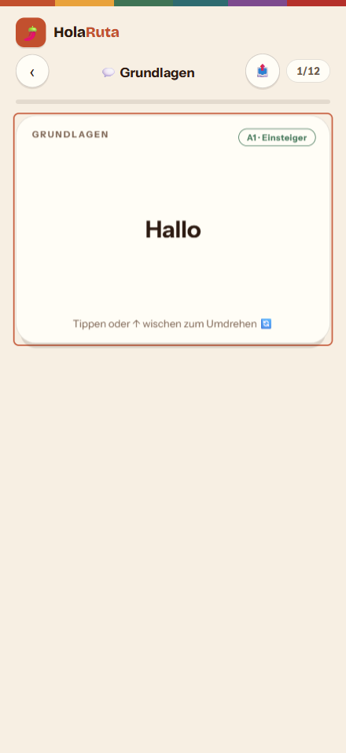
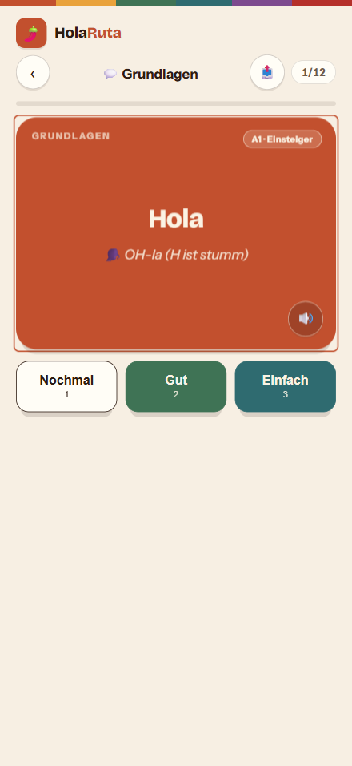
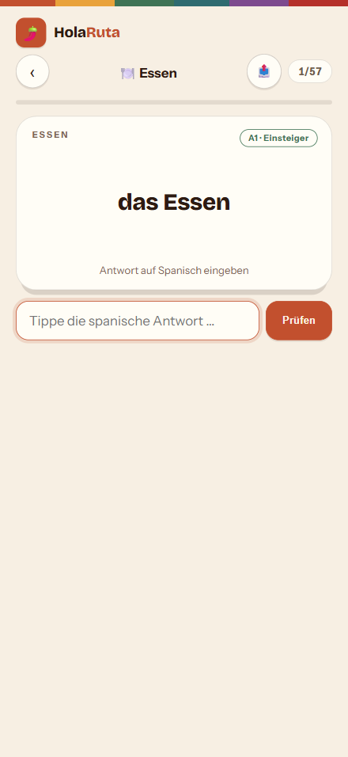
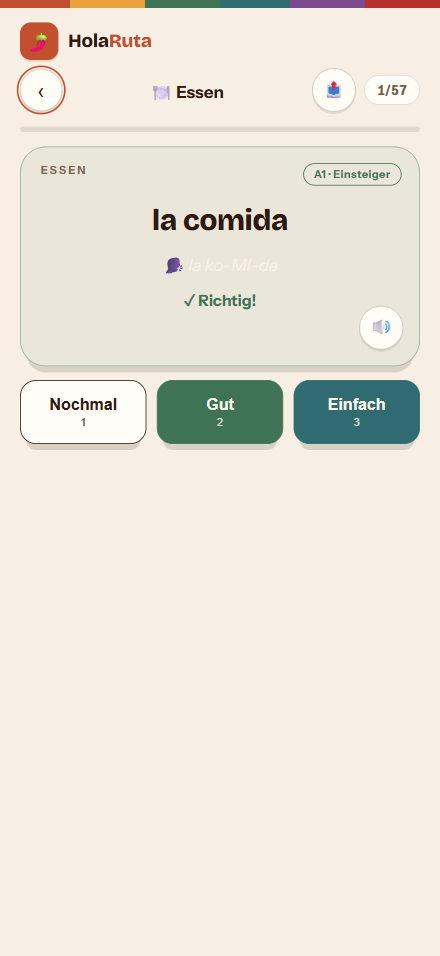
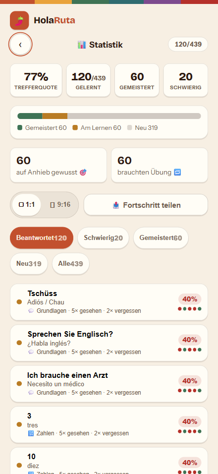
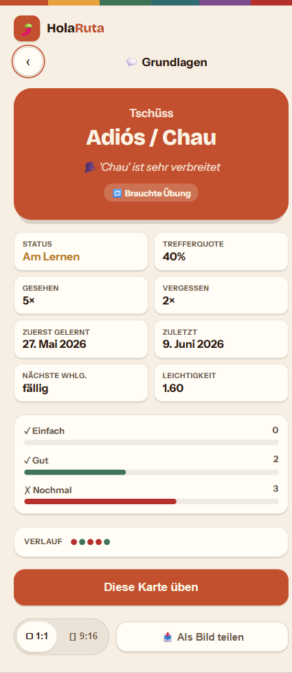
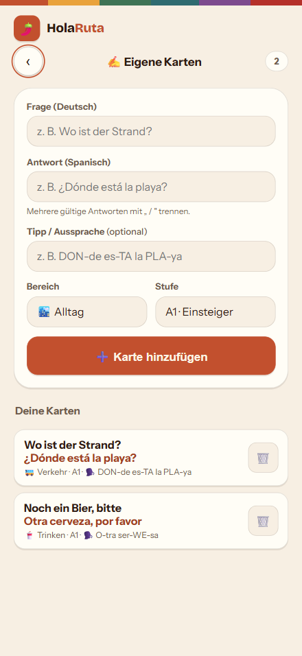
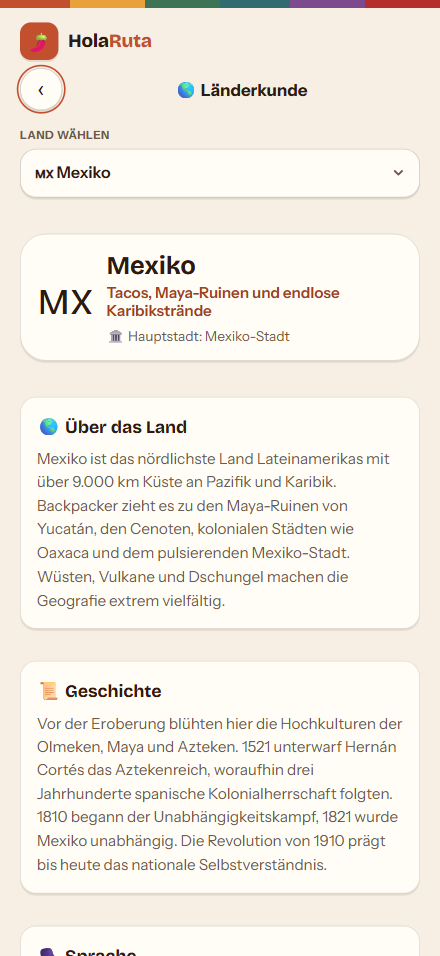

<div align="center">

# 🌶️ HolaRuta

**Dein Reise-Spanisch für echte Situationen — Karteikarten mit Spaced Repetition für Bus, Hotel, Essen, Geld, Notfall und Smalltalk.**

**v1.2.0** — 561 Karten · 19 Bereiche · Hostel Mode (Battle & Rollenspiele) · Definiciones (Zuordnen-Quiz) · Spaced Repetition · Offline · Null Dependencies

[](#-tech-stack)
[](#-offline--pwa)
[](#-architektur)
[](#-tests)
[](#datenmodell)
[](#-die-w%C3%B6rterbasis)
[](#-lizenz)

Schnell lernen · Großzügig prüfen · Komplett mit dem Daumen · Spricht Spanisch vor · Funktioniert ohne Netz

**[🚀 Schnellstart](#-schnellstart)** &nbsp;|&nbsp; **[🏗 Architektur](#-architektur)** &nbsp;|&nbsp; **[🧠 Spaced Repetition](#-spaced-repetition-sm-2)** &nbsp;|&nbsp; **[🔍 Audit](AUDIT.md)**

<details>
<summary><b>Inhaltsverzeichnis</b></summary>

- [Überblick](#überblick)
- [Screenshots](#-screenshots)
- [Features](#-features)
- [Die Wörterbasis](#-die-wörterbasis)
- [Architektur](#-architektur)
- [Schnellstart](#-schnellstart)
- [Single-File-Build](#-single-file-build)
- [Datenmodell](#datenmodell)
- [Spaced Repetition (SM-2)](#-spaced-repetition-sm-2)
- [Ruta-Pass (Badges)](#️-ruta-pass-badges)
- [Antwort-Matcher](#-antwort-matcher)
- [Offline & PWA](#-offline--pwa)
- [Tech Stack](#-tech-stack)
- [Design-Prinzipien](#-design-prinzipien)
- [Tests](#-tests)
- [Projektstatus](#-projektstatus)
- [Lizenz](#-lizenz)

</details>

</div>

---

## Überblick

**HolaRuta** ist eine Lernkarten-PWA für Survival-Spanisch beim Backpacking durch Lateinamerika. Kein Schulbuch-Spanisch, sondern genau die Sätze, die man am Busbahnhof, an der Grenze, im Hostel und beim Essen wirklich braucht — durchgängig **LatAm-korrekt** (colectivo, vuelto, plata, chévere, celular).

Die App ist eine **einzige statische Web-App ohne Build-Zwang und ohne Runtime-Dependencies**. Sie läuft im Browser, lässt sich als App installieren und funktioniert komplett **offline**. Der gesamte Lernfortschritt bleibt lokal auf dem Gerät — kein Konto, kein Server, kein Tracking.

**Kernversprechen:** In Sekunden eine Karte lernen, großzügig getippte Antworten prüfen, mit dem Daumen durch die Sitzung wischen — und nur das wiederholen, was wirklich fällig ist.

**Kernprinzipien:**

- **Null Dependencies** — Reines Vanilla JS. Kein Framework, kein Bundler, kein `node_modules` zur Laufzeit. Nur Module, die sich an `window.SC` hängen.
- **Reine Funktionen im Kern** — `srs`, `matcher` und `stats` kennen weder UI noch Speicher. Sie nehmen Zustand + Eingabe und geben **neuen** Zustand zurück (Immutability durchgängig).
- **Offline first** — Service Worker cacht die komplette App. Einmal geladen, läuft sie ohne Netz weiter.
- **Privacy by Design** — Fortschritt, Einstellungen und eigene Karten leben ausschließlich im `localStorage`. Es verlässt nichts das Gerät.
- **Graceful Degradation** — Kein `localStorage`? Kein TTS? Kein Service Worker? Die App läuft trotzdem, nur ohne das jeweilige Extra.

---

## 📸 Screenshots

<div align="center">

| Startseite | Sprechen (Flip) | Antwort aufgedeckt |
|:----------:|:---------------:|:------------------:|
|  |  |  |

| Schreiben (Type) | Antwort geprüft | Statistik |
|:----------------:|:---------------:|:---------:|
|  |  |  |

| Karten-Detail | Eigene Karten | Länderkunde |
|:-------------:|:-------------:|:-----------:|
|  |  |  |

</div>

> Erdton-Palette im Lateinamerika-Look, 3D-Flip-Animation, komplett mit dem Daumen bedienbar.

---

## ✨ Features

| Bereich | Feature | Details |
|---|---|---|
| **Lernmodus** | Sprechen (Flip) | Karte antippen / Space → 3D-Flip zeigt die Antwort, dann bewerten |
| **Lernmodus** | Schreiben (Type) | Antwort tippen → großzügiger Matcher prüft (akzent- & satzzeichen-tolerant) |
| **Richtung** | DE→ES / ES→DE | Lernrichtung jederzeit umschaltbar, wird gemerkt |
| **Spaced Repetition** | Eigene SM-2-Engine | 3-Tasten-Bewertung (Nochmal / Gut / Einfach), Intervall- & Ease-Berechnung |
| **Stufen-Filter** | A1 / A2 / B1 | Mehrfachauswahl der Schwierigkeitsstufen, kombinierbar mit Bereich |
| **19 Bereiche** | Themen-Kategorien | Grundlagen, Zahlen, Essen, Trinken, Hotel, Hostel, Social, Verkehr, Einkaufen, Geld, Notfall, Zeit, Smalltalk, Alltag, Sätze, Behörden, Busreise, Kleidungsschmuck, Wegbeschreibung |
| **Hostel Mode** | Üben zu zweit 🛏️ | **Battle** (Aufgabe auf Deutsch, laut auf Spanisch antworten, Mitspieler bewertet 2/1/0 über 10 Runden) & **Rollenspiele** (kurze Dialoge mit verteilten Rollen) — plus Real-Life-Challenge als Bonus |
| **Definiciones** | Zuordnen-Quiz 🧩 | Eigenständiges Modul im Stil eines Lehrbuch-Arbeitsblatts: **spanische Definition lesen, passenden Begriff aus mehreren Optionen wählen** — mit sofortiger Rückmeldung, Fortschrittsbalken und Auswertung. Themen-Listen (*En la ciudad*, *En la ruta* mit Backpacker-Orten, *La comida*); lernt Wörter über ihre Bedeutung statt nur per Übersetzung. Zahlt auf den Ruta-Pass ein |
| **Reise-Kontext** | 🧭 Kontext-Button | Runder Button unten links auf der Antwortkarte (Pendant zum 🔊): klappt einen Block mit echtem Reisesatz, typischer Situation und kurzem Reisetipp auf — für **alle 561 Karten**. Zeigt, *wie* man den Ausdruck unterwegs wirklich benutzt (statt nur zu übersetzen); Zahlen bekommen praktischen Preis-/Mengen-Kontext |
| **Statistik** | Lern-Auswertung | Trefferquote, gemeistert / schwierig / neu, sortierte Kartenliste, Detailseite je Karte |
| **Ruta-Pass** | Badges / Reisestempel 🎖️ | Sammelbare Stempel für Lernmenge, Lern-Serie (Streak), Bereichs-Meisterschaft & Spezielles — inkl. Geheim-Stempel und Freischalt-Einblendung |
| **Eigene Karten** | Editor | Eigene Vokabeln anlegen — erscheinen überall ohne Sonderbehandlung |
| **Dark Mode** | Fürs Hostel-Bett 🌙 | Warmer, augenschonender Nachtmodus per 🌙/☀️-Schalter; folgt sonst der System-Vorliebe, Wahl wird gemerkt |
| **Sprachausgabe** | TTS (Web Speech API) | Spricht die spanische Antwort vor, bevorzugt eine LatAm-Stimme |
| **Sharepics** | Canvas-Bildgenerator | Karte oder Fortschritt als teilbares PNG (1:1 Feed oder 9:16 Story) |
| **Länderkunde** | 19 Länder | Hauptstadt, Geschichte, Sprache, typische Wörter, Essen, Trinken & Reisetipp |
| **Touch + Tastatur** | Vollständige Bedienung | Wischgesten (←/↑/→), Tasten 1/2/3/Space/p, Haptik-Feedback wo verfügbar |
| **PWA** | Installierbar & offline | Service Worker, Manifest, Homescreen-Icon, App-Shell-Fallback |
| **Accessibility** | A11y-Maßnahmen | Fokus-Management nach Render, `aria-live`-Regionen, `prefers-reduced-motion`, ≥44px Tap-Targets |

---

## 🌎 Die Wörterbasis

**561 Karten · 19 Bereiche · 3 Stufen — durchgängig auf lateinamerikanisches Spanisch ausgelegt.**

Die Inhalte sind das Herz der App und wurden in einem [4-Agenten-Audit](AUDIT.md) live im Browser gegengeprüft: **0 Duplikate, 0 fehlende Felder, 0 ¿¡-Mismatches, keine falschen Übersetzungen**.

| Eigenschaft | Umsetzung |
|---|---|
| **LatAm-Vokabular** | `colectivo`, `vuelto`, `plata`, `chévere`, `chip`, `celular` statt Spanien-Spanisch |
| **Aussprache-Tipps** | Konsistentes Schema mit Betonung (z.B. „OH-la", „BUE-nos DI-as"), berücksichtigt yeísmo & seseo |
| **Mehrfachantworten** | Gültige Alternativen mit `/` getrennt (`Adiós / Chau`) oder explizit per `alt[]` |
| **Korrekte Akzentuierung** | Akzente, `ñ` und `¿¡`-Paare durchgängig sauber gesetzt |

**Verteilung der Karten je Bereich:**

| Bereich | Karten | Bereich | Karten | Bereich | Karten |
|---|---:|---|---:|---|---:|
| Zahlen | 110 | Wegbeschreibung | 65 | Essen | 60 |
| Kleidungsschmuck | 37 | Compras (Einkaufen) | 34 | Sätze | 30 |
| Verkehr | 27 | Smalltalk | 24 | Hotel | 24 |
| Grundlagen | 21 | Busreise | 20 | Behörden | 20 |
| Notfall | 15 | Alltag | 15 | Trinken | 14 |
| Geld | 13 | Zeit | 12 | Social | 10 |
| Hostel | 10 | | | | |

> Hinzu kommen die **Hostel-Mode-Daten** (`BATTLES`, `ROLEPLAYS`, `CHALLENGES`) für das Üben zu zweit — separate Arrays, die nicht in die Kartenzählung eingehen.

---

## 🏗 Architektur

HolaRuta ist eine **klassische, entkoppelte Vanilla-JS-App**: jede Datei ist ein IIFE-Modul, das sich an einen gemeinsamen `window.SC`-Namespace hängt. Die Lade-Reihenfolge in [index.html](index.html) spiegelt den Datenfluss wider — erst Daten & Logik, dann View, zuletzt Controller.

### Datenfluss

```
data / countries   →   srs / matcher / stats   →   app (Controller)   →   ui   →   DOM
   (reine Daten)        (reine Funktionen)          (State + Events)     (HTML)
                                  ↑                        ↓
                              store  ←──  localStorage (Fortschritt, Einstellungen, eigene Karten)
```

### Module

```
SpanischCard/
├── index.html          # App-Shell + Modul-Ladereihenfolge
├── styles.css          # Komplettes Design (Erdton-Palette, 3D-Flip, Responsive)
│
├── data.js        SC.data       # Modell: 19 Kategorien, 3 Stufen, 561 Karten + Hostel-Mode- & Definiciones-Daten (REINE DATEN)
├── contextdata.js SC.contextData # Reise-Kontext-Inhalte je Karte ({e,d,s,n}) – REINE DATEN
├── context.js     SC.context    # hängt Kontext an die Karten (Zahlen generiert) – REINE FUNKTIONEN
├── countries.js   SC.countries  # Länderkunde: 19 Länder in 3 Regionen
│
├── srs.js         SC.srs        # Spaced Repetition (SM-2) — REINE FUNKTIONEN
├── matcher.js     SC.matcher    # Antwortprüfung, akzent-/satzzeichen-tolerant — REINE FUNKTIONEN
├── stats.js       SC.stats      # Auswertung pro Karte & gesamt — REINE FUNKTIONEN
├── badges.js      SC.badges     # Ruta-Pass: Badge-Definitionen + Auswertung — REINE FUNKTIONEN
│
├── store.js       SC.store      # Persistenz — kapselt localStorage komplett weg
├── usercards.js   SC.userCards  # Eigene Karten (anlegen/löschen/validieren)
├── speech.js      SC.speech     # Sprachausgabe via Web Speech API (LatAm-Stimme)
├── share.js       SC.share      # Sharepic-Generator (Canvas → PNG, Web Share API)
│
├── ui.js          SC.ui         # Views: Zustand → HTML-String (renderHome/Study/Stats/…)
├── app.js         SC.app        # Controller: State, View-Modelle, Event-Delegation
│
├── build.js                     # Erzeugt die Einzeldatei HolaRuta.html
├── service-worker.js            # Offline-Cache (Cache-first + App-Shell-Fallback)
├── manifest.webmanifest         # PWA-Manifest (Name, Icons, Theme)
├── icon.svg                     # App-Icon
│
├── test/sc.test.js              # 54 Tests (node:test, keine Dependencies)
└── AUDIT.md                     # Vollständiges Code-/UX-/A11y-/Security-Audit
```

### Architektur-Entscheidungen

| Entscheidung | Begründung |
|---|---|
| **Kein Framework, kein Bundler** | Maximale Langlebigkeit & Portabilität. Die App ist in 10 Jahren noch ladbar. |
| **`window.SC`-IIFE-Module** | Klare Trennung ohne Build-Step; jedes Modul hat eine einzige Verantwortung. |
| **Reine Logik (`srs`/`matcher`/`stats`)** | Kennt weder DOM noch `localStorage` → trivial test- & wiederverwendbar. |
| **Immutability durchgängig** | Funktionen geben **neue** Objekte zurück, mutieren nie das Original — keine versteckten Seiteneffekte. |
| **Event-Delegation** | Ein einziger Listener auf `#app`; Buttons tragen `data-action`. Keine Listener-Leaks beim Re-Render. |
| **Single Source of Truth** | Ein `state`-Objekt im Controller; jede Aktion → `render()`. |

---

## 🚀 Schnellstart

HolaRuta braucht **keine Installation und keinen Build**. Es ist statisches HTML/CSS/JS.

### Variante A — einfach öffnen (Einzeldatei)

```bash
# HolaRuta.html ist die fertige, eigenständige Version (alles eingebettet).
# Doppelklick genügt — läuft offline, ohne Server.
```

> **Hinweis:** In der Einzeldatei sind PWA-Features (Service Worker, Installation) deaktiviert, da `file://` keinen Service Worker erlaubt. Für die volle PWA siehe Variante B.

### Variante B — als PWA lokal servieren (volle Funktion)

```bash
# Beliebiger statischer Server im Projektordner, z.B.:
npx serve .
#  →  http://localhost:3000

# Alternativ Python:
python -m http.server 3000
```

Im Browser öffnen → die App registriert den Service Worker, wird offline-fähig und lässt sich über „Zum Startbildschirm hinzufügen" installieren.

### Voraussetzungen

| Zweck | Anforderung |
|---|---|
| App nutzen | Moderner Browser (Chrome, Safari, Firefox, Edge) |
| Tests / Build | Node.js ≥ 18 (nur für `node --test` und `node build.js`) |

> Es gibt **keine** Laufzeit-Abhängigkeiten. `package.json` enthält nur zwei Scripts (`test`, `build`) und keinerlei `dependencies`.

---

## 📦 Single-File-Build

Quelle der Wahrheit sind immer die **Module**. [build.js](build.js) fügt sie zu einer versandfertigen Einzeldatei zusammen:

```bash
node build.js
#  ✓ HolaRuta.html erzeugt.
#    Eingebettet: styles.css, data.js, countries.js, srs.js, …
```

**Was der Build tut:**

- Bettet `styles.css` als `<style>` ein
- Bettet jedes `<script src="…">` als Inline-`<script>` ein (in Ladereihenfolge)
- Escaped `</script>` im Code, damit der HTML-Parser nicht stolpert
- Entfernt PWA-Verweise (Manifest/Icon lösen unter `file://` nicht auf)
- Externe Links (Google Fonts) bleiben unverändert

> **Wichtig:** `HolaRuta.html` ist ein **Ergebnis** des Builds und wird nie von Hand bearbeitet.

---

## Datenmodell

Alles Persistente liegt im `localStorage` — sauber versioniert und durch Strukturwächter gegen Korruption abgesichert ([store.js](store.js)).

| Key | Inhalt |
|---|---|
| `spanischcard.progress.v2` | Lernfortschritt pro Karte (SRS-Zustand + Statistik-Felder) |
| `spanischcard.settings.v1` | Einstellungen (Modus, Richtung, Stufen-Filter, Share-Format, Theme, letzte Kategorie, Einstellungs-Panel auf/zu, aktiver Start-Reiter) |
| `spanischcard.usercards.v1` | Vom Nutzer angelegte eigene Karten |
| `spanischcard.gamestats.v1` | Ruta-Pass: Spiel-Zähler (Streak, Tageszeit-Marken, „Nochmal“, Hostel-Mode-Battles & -Rollenspiele, Definiciones-Quizze, geöffnete Reise-Kontexte) + freigeschaltete Badges |

### Karte

```js
{ id: "b18", cat: "notfall", lvl: 2, de: "Ich brauche einen Arzt",
  es: "Necesito un médico", tip: "ne-ce-SI-to un ME-di-co", alt?: [...],
  context?: { sentenceEs, sentenceDe, situation, note } }
```

| Feld | Bedeutung |
|---|---|
| `cat` | Kategorie-Id (eine von 18) |
| `lvl` | Stufe: `1` Einsteiger (A1) · `2` Mittel (A2) · `3` Fortgeschritten (B1) |
| `de` | Frage (Deutsch) |
| `es` | Antwort (Spanisch); mehrere gültige Antworten mit `/` getrennt |
| `tip` | Aussprache-/Merkhinweis (optional) |
| `alt` | Explizite Liste akzeptierter Tipp-Antworten (optional) |
| `context` | Reise-Kontext (optional): `sentenceEs`/`sentenceDe` (echter Beispielsatz), `situation` (wann nutzt man das?), `note` (kurzer Reisetipp). Per **🧭 Kontext**-Button aufklappbar |

### Lernzustand pro Karte (`progress[id]`)

```js
{ ease: 2.5, interval: 6, due: 1717977600000, reps: 3,   // SRS
  seen: 4, again: 1, good: 2, easy: 1, lapses: 0,         // Statistik
  firstAt, lastAt, firstRating: "good", history: "gage" } // Verlauf
```

### Kartenstatus (abgeleitet)

| Status | Bedingung |
|---|---|
| **new** | Noch nie bewertet |
| **learning** | Bewertet, Intervall < 7 Tage |
| **mastered** | Intervall ≥ 7 Tage |
| **hard** | ≥ 2× gesehen und Trefferquote < 60 % |
| **firstTry** | Auf Anhieb gewusst — erste Bewertung Gut/Einfach und nie „Nochmal" |

---

## 🧠 Spaced Repetition (SM-2)

[srs.js](srs.js) implementiert eine vereinfachte **SM-2**-Engine als reine, immutable Funktion: `review(state, rating) → newState`.

| Bewertung | Wirkung |
|---|---|
| **Nochmal** (`again`) | `ease − 0.2` (min. 1.3), Intervall → 0, in ~1 Min. erneut in derselben Sitzung |
| **Gut** (`good`) | rep 0 → 1 Tag · rep 1 → 3 Tage · danach `interval × ease` |
| **Einfach** (`easy`) | `ease + 0.15`, rep 0 → 3 Tage · rep 1 → 6 Tage · danach `interval × ease` |

- **Ease-Grenzen:** `1.3 ≤ ease ≤ 3.0`
- **Fälligkeit:** `isDue` ist `true`, sobald `due ≤ jetzt` (neue Karten sind sofort fällig)
- **Re-Queue:** „Nochmal" hängt die Karte ans Ende der laufenden Sitzung

Bei Sitzungsstart wählt der Controller alle **fälligen** Karten im gewählten Bereich/Stufen-Filter. Ist nichts fällig, startet automatisch **freies Üben** über alle Karten des Bereichs. Eine Runde umfasst höchstens **20 Karten** – der Rest bleibt fällig und kommt in der nächsten Runde dran.

---

## 🎖️ Ruta-Pass (Badges)

[badges.js](badges.js) ist eine **reine Daten-/Funktionsschicht** im Stil von `srs`/`stats`: sie kennt weder DOM noch Speicher. Ein Badge ist nur eine Beschreibung; ob es freigeschaltet ist, ergibt sich generisch aus einer **Metrik + Schwelle**.

```
progress + gamestats  →  buildMetrics()  →  metrics  →  evaluate()  →  Stempel-Liste
```

| Badge-Typ | Bedeutung |
|---|---|
| `counter` | `metrics[metric] ≥ threshold` (z.B. 50 gelernte Karten, Streak ≥ 7) |
| `flag` | Ein Ereignis ist eingetreten (z.B. nach 22 Uhr gelernt) |
| `categoryMastery` | ≥ 80 % der Karten eines Bereichs gemeistert |
| `allReviewed` | Alle Karten mindestens einmal gelernt |

**Gruppen:** Lernreise (Lernmenge), Dranbleiben (Streak), Bereiche (je Kategorie ein Stempel — inkl. **Hostel** & **Social**), **Reise-Kontext** (geöffnete 🧭-Kontexte: *Erster Aha-Moment* → *Kontext-Kompass* → *Real-Life Ready*), **Hostel Mode** (Battle & Rollenspiele), **Definiciones** (abgeschlossene & fehlerfreie Zuordnen-Quizze), **Mutproben** (Real-Life Challenges) und Spezial (inkl. **Geheim-Stempel**, die erst nach Freischaltung sichtbar werden).

Der **Hostel Mode** zahlt direkt auf den Pass ein: ein beendetes Battle schaltet *First Duel* frei, ein klarer Sieg *Dorm Champion*, eine fehlerfreie Partie *Perfect Check-in*, ein Sieg nach Rückstand *Comeback Kid*; gespielte Rollenspiele füllen *First Scene* und *Scene Collector*. Hakst du die **Real-Life Challenge** nach einem Battle als „geschafft“ ab, zählt das auf *Mutiger erster Satz* und *Comfort Zone Exit*. Gezählt wird in denselben `gamestats` (battlesPlayed/-Won/perfect/comebacks, distinkte Rollenspiele & Challenges).

- **Tracking:** Beim Bewerten bucht der Controller einen kleinen Satz Spiel-Zähler in `gamestats` (Gesamt-Bewertungen, Lern-Serie/Streak, Tageszeit-Marken, „Nochmal“-Drücke) und schaltet erfüllte Badges frei.
- **Freischaltung bleibt erhalten:** Einmal vergeben, bleibt ein Stempel im Pass — auch wenn sich abgeleitete Werte später ändern. Eine kurze Glückwunsch-Einblendung zeigt frische Stempel.
- **Bestandsnutzer:** Beim Start werden bereits erfüllte Badges still nachgetragen (kein Einblendungs-Stau).
- **Konsistenz:** „Fortschritt zurücksetzen“ löscht auch Streak & Stempel.

---

## 🔍 Antwort-Matcher

Der Schreiben-Modus prüft Eingaben **großzügig** ([matcher.js](matcher.js)) — Lernende sollen am Inhalt scheitern, nicht an Tippfehlern:

```js
matcher.check("necesito un medico", card)   // → { correct: true, … }
```

Normalisiert wird über:

- **Groß-/Kleinschreibung** → egal (`MEDICO` = `médico`)
- **Akzente** → egal, via NFD-Zerlegung (`médico` = `medico`)
- **Satzzeichen** → entfernt (`¿`, `?`, `¡`, `!`, `.`, `,`, `;`, `:`)
- **Mehrfach-Leerzeichen** → auf eines reduziert
- **Mehrfachantworten** → jede `/`-Alternative bzw. jeder `alt[]`-Eintrag matcht eigenständig

---

## 📲 Offline & PWA

[service-worker.js](service-worker.js) macht HolaRuta zur installierbaren, offline-fähigen App:

- **Strategie:** *Cache-first* für die App-Shell — startet sofort, auch ohne Netz
- **Versionierung:** `CACHE_VERSION` bumpen → alte Caches werden beim Aktivieren entfernt, frische Inhalte geladen
- **Navigations-Fallback:** Bei Seitenaufrufen ohne Treffer liefert der SW `index.html` statt eines Netzwerkfehlers
- **Manifest:** Standalone-Display, Portrait, Markenfarbe `#241510`, Kategorien `education` + `travel`

---

## ⚙️ Tech Stack

| Schicht | Technologie | Begründung |
|---|---|---|
| **Sprache** | Vanilla JavaScript (ES2017) | Keine Transpilation nötig, läuft überall, altert nicht |
| **UI** | Eigenes String-Rendering → `innerHTML` | Kein Virtual DOM, kein Framework-Overhead |
| **State** | Ein `state`-Objekt + `render()` | Vorhersehbar, debugbar, minimal |
| **Styling** | Handgeschriebenes CSS | Erdton-Palette, CSS Custom Properties, 3D-Flip, Responsive |
| **Persistenz** | `localStorage` (gekapselt in `store`) | Kein Backend, volle Datenhoheit beim Nutzer |
| **Sprachausgabe** | Web Speech API (`SpeechSynthesis`) | Eingebaut, keine Dependency, LatAm-Stimmenwahl |
| **Sharepics** | Canvas 2D | Generiert PNGs für Web Share API ohne Server |
| **Offline** | Service Worker + Web App Manifest | Installierbare PWA |
| **Tests** | `node:test` (eingebaut) | Null Test-Dependencies |
| **Schriften** | Bricolage Grotesque + Instrument Sans | Mit System-Font-Fallback offline |

**Laufzeit-Dependencies: 0.** &nbsp;|&nbsp; **Build-Dependencies: 0.** &nbsp;|&nbsp; **Test-Dependencies: 0.**

---

## 🎯 Design-Prinzipien

| # | Regel | Begründung |
|---|---|---|
| 1 | **Reine Daten getrennt von reiner Logik** | `data`/`countries` enthalten keine Logik; `srs`/`matcher`/`stats` enthalten keine Daten oder I/O. |
| 2 | **Immutability** | Funktionen geben neue Objekte zurück (`Object.assign({}, …)`), mutieren nie das Original. |
| 3 | **Graceful Degradation** | Jede optionale Fähigkeit (TTS, Share, SW, localStorage) wird geprüft, bevor sie genutzt wird. |
| 4 | **Single Source of Truth** | Ein `state`; jede Aktion endet in `render()`. Kein verstreuter UI-Zustand. |
| 5 | **Inhalte sind heilig** | Die Wörterbasis wird nur mit Beleg geändert — keine „Verbesserung" auf Verdacht. |
| 6 | **A11y by Default** | Fokus nach Render gesetzt, `aria-live` für Ergebnisse, Reduced-Motion respektiert, Tap-Targets ≥ 44px. |

---

## 🧪 Tests

Die testbare Kernlogik (`srs`, `matcher`, `stats`) ist vollständig von DOM und Speicher entkoppelt und wird mit dem **eingebauten Node-Test-Runner** geprüft — ohne jede Dependency.

```bash
npm test            # bzw. node --test
#  ℹ tests 54
#  ℹ pass 49
#  ℹ fail 0
```

Statische Prüfung:

```bash
node --check *.js   # Syntax-Check aller Module
node build.js       # Build muss fehlerfrei durchlaufen
```

Zusätzlich wurde die App in einem **Live-Browser-Audit** (Playwright) end-to-end gegengeprüft: Home, Flip, Rating, Type-Matcher, Persistenz nach Reload, Editor, XSS-Probe, Statistik — **0 Konsolen-Errors**. Details in [AUDIT.md](AUDIT.md).

---

## 📊 Projektstatus

| Kennzahl | Wert |
|---|---|
| Karten | 561 |
| Bereiche / Kategorien | 18 |
| Stufen | 3 (A1, A2, B1) |
| Länderkunde | 19 Länder, 3 Regionen |
| JS-Module | 15 (`SC.*`) |
| Tests | 54 (alle grün) |
| Laufzeit-Dependencies | 0 |
| Code-Audit | abgeschlossen — 0 CRITICAL ([AUDIT.md](AUDIT.md)) |

**Audit-Ergebnis (Stand 2026-06-10):** Keine CRITICALs — kein Crash, kein exploitierbares XSS, keine falschen Übersetzungen. Schwerpunkte der Nacharbeit lagen in **Accessibility** und **PWA-Details**; die wichtigsten Fixes sind umgesetzt.

---

## 🤝 Beitragen

- **Neue Karte:** ans passende Array in [data.js](data.js) anhängen (`lvl` nicht vergessen).
- **Neue Kategorie:** oben in `CATEGORIES` ergänzen.
- **Logik geändert?** `node --test` muss grün bleiben.
- **Vor dem Versand:** `node build.js` ausführen — `HolaRuta.html` nie von Hand editieren.
- **Commits:** Conventional Commits (`feat:`, `fix:`, `refactor:`, `docs:`).

---

## 📄 Lizenz

Privates Projekt — alle Rechte vorbehalten.
Keine Nutzung, Vervielfältigung oder Verbreitung ohne ausdrückliche Genehmigung.

---

<div align="center">

**HolaRuta** — Reise-Spanisch für echte Situationen. 🌶️

</div>
